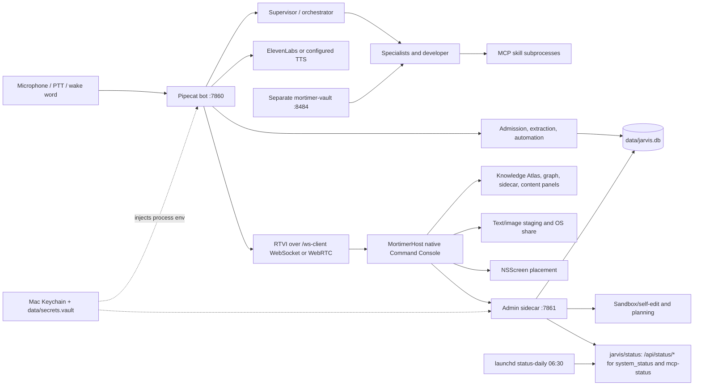

# Mortimer architecture reference

**Reference status:** source map, added 2026-09-18. **Last source audit:**
2026-09-22 against `main` `88b206f`; the runtime-checkout observations under
"Configuration and deployment paths" (2026-09-17/18) were not re-observed.
A navigation aid; track plans stay authoritative for requirements and gates.

## Runtime shape



Transport: `jarvis/bot/bot.py` serves `/ws-client` (WebSocket) and
`/api/offer` (SmallWebRTC). A loopback `JarvisClient` uses
`NativeAudioTransport` over `/ws-client`; `JARVIS_FORCE_WEBRTC` is the
rollback, and a remote bot uses WebRTC.

The bot owns the voice session, Supervisor turn, tool registration, memory
session lifecycle and speech output; results that land after a session ends
wait in the `notices` outbox for the next greeting. `MortimerHost` owns native windows,
layout, drawer tabs, Atlas/graph state, display placement and content
sharing. The admin sidecar owns self-edit, planning, run status and
HTTP inspection. MCP servers are subprocesses with declared credentials and
no UI state, held by one supervised registry per bot process. SQLite durably owns conversations, memories, jobs, receipts and
run metadata.

Layout 2 (`CommandConsoleView`) is the default. Layouts 0/1 and the frozen
web console (`scripts/run_web.sh`) stay as rollback until the Command Console
physical and daily-driver gates close.

The self-edit planner and `inject_repo_map` sub-agents receive this file,
capped at 12,000 chars, with `docs/REPO_MAP.md`. `GET /api/architecture`
serves it and the Repo sidecar renders it with its SHA-256; both read on
demand, keep no copy and grant no edit authority.

## Trust and data boundaries

- The bot and sidecar bind to localhost; remote access is a separate track.
- User speech is transient audio, transcript input and (when enabled) a local
  conversation row. Memory admission is bounded, redacts credential patterns,
  and applies source-role and evidence policy before durable promotion.
- Memory classification gets bounded redacted candidates and returns metadata
  only; it cannot grant permissions, write content or override a user
  correction. Shadow receipts hold a digest and metrics, not candidate text.
- Inbound text/image is staged locally and needs an explicit approval
  manifest before provider delivery; imported content and derived results are
  ephemeral.
- Outward sharing freezes the selected result before opening the OS picker;
  opening a picker is not reported as delivery.
- `jarvis.vault.inject_env()` loads secrets from `data/secrets.vault` and the
  macOS Keychain. A running checkout may set `JARVIS_VAULT_PATH`; secrets are
  never copied into candidate worktrees or committed to `.env`.

## Model routes

No single project-wide model setting exists. `OPENAI_MODEL`/`OPENAI_BASE_URL`
(`jarvis/config.py`) configure only the voice Supervisor.

- `config/model_access.yaml` + `jarvis/model_routing.py` separate model
  identity from access route (`direct_api`, `subscription`,
  `codex_subscription`, `saygm`, `local`) and workload privacy.
  `JARVIS_MODEL_ROUTING_ENABLED` defaults to false while adapters are
  qualified; overrides are `JARVIS_MODEL_ROUTE_<WORKLOAD>` and
  `JARVIS_MODEL_PROFILE_<WORKLOAD>`.
- `jarvis/saygm.py`: a SAYGM route is confidential only when the catalog
  confirms `tier: confidential` and the `-TEE` suffix; other SAYGM routes are
  external processing. `GET /api/model-routes` shows status without secrets.
- `scripts/verify_model_access.py` checks key presence without printing
  secrets (contacts providers only with `--saygm`/`--probe-subscriptions`);
  `scripts/audit_model_call_sites.py --require-covered` fails on an
  unclassified production completion call site.
- `jarvis/privacy_policy.py` enforces local-only/confidential/approved-external
  before a request; `jarvis/model_execution.py` is the provider-neutral
  contract; tool permissions stay with agent and sandbox layers.
  `jarvis/model_preferences.py` holds drafts and confirmed choices for the
  Repo sidecar and gated `model_route` voice tool. Council, planning and
  shadow calls reject a route that fails a stricter `data_policy`; enabled
  confidential/local-only policies also redact the run log.
- `claude-haiku-4-5` is a voice-only built-in route, absent from the registry.
- Registry: `config/model_profiles.yaml` (routine; profiles name an
  `endpoint:`) + `config/model_endpoints.yaml` (deny; hosts, key names,
  planner pin), joined only by `load_model_registry`; a profile with a host
  or key fails the load. Daily catalogues: `data/status/generated/`.
- Claude/Codex subscription adapters are text-only (tool calls rejected);
  `jarvis/subscription.py` strips inherited API keys and endpoints before the
  CLI launches, so subscription traffic cannot become paid API traffic.
  Protected delegation text is masked in activity events and native UI.
- With the per-turn sensitive latch armed, the MCP registry refuses external
  web, app, screen-vision, self-edit and status servers; local tools stay usable.

| Workload | Source of selection | Current policy | Credential/endpoint behavior |
| --- | --- | --- | --- |
| Voice Supervisor/orchestrator | `OPENAI_MODEL`, `OPENAI_BASE_URL`, `jarvis/bot/pipeline.py` | Haiku dispatcher; delegates, never builds | Voice configuration and its provider key |
| Scheduler, Librarian, Analyst, Systems | `config/agents.yaml` → `claude-sonnet-5` | Refuse on missing profile/key; no Supervisor fallback | Registry profile route |
| Developer, App Builder | `config/agents.yaml` → `claude-opus` | Refuse on missing profile/key; build-grade model | Registry profile route |
| Optional Codex subscription workload | explicit `codex-subscription` profile + `codex_subscription` route | Text-only until tools are validated; no API-key fallback | Authenticated Codex CLI subscription |
| Planner/self-edit executor | `JARVIS_UPGRADE_PROFILE` / `JARVIS_APPBUILD_PROFILE`, registry default per plan | Profile and refusal/fallback recorded in the sidecar | Registry profile route |
| Research comparison writer | `JARVIS_PLANNING_PROFILE` → registry default | Never the voice Supervisor; profile recorded with the result | Registry profile route plus Tavily crawl |
| Council | `jarvis/council/config.py` plus registry pool | Council exclusion and tier rules | Per-profile registry route |
| Vision | `vision` workload in `config/model_access.yaml` if routing is on, else `JARVIS_VISION_PROFILE` | Image-capable profile required; else fails closed | Validated registry profile route |
| Background extraction and maintenance sweep | `jarvis/memory_extraction.py`, `jarvis/memory_sweep.py` | `JARVIS_MEMORY_PROFILE` route, default registry `claude-sonnet-5`; fails closed without its credential | Profile route via `jarvis/memory_model.py` |
| Knowledge-base digest and procedure description | `jarvis/kb_digest.py`, `jarvis/procedures.py` | `JARVIS_BACKGROUND_PROFILE` route, default registry `claude-sonnet-5`; never inherits the Supervisor route | Profile route via `jarvis/memory_model.py` |
| New memory classifier shadow and staged rollout | Live bot: `heuristic_classifier` in `jarvis/memory_automation.py` (no model). Model classifier only in `scripts/run_memory_provider_shadow.py --profile NAME` | Admission ordered by `JARVIS_MEMORY_AUTOMATION_STAGE` (`shadow` → `explicit_preferences` → `corroborated_inferences`); unknown fails closed | Shadow profile supplies model, provider, endpoint, key, temperature |

Haiku is reserved for the voice Supervisor; no profile in a background row
may resolve to it. Each background family is independently selectable. Provider
shadow receipt: `docs/acceptance/memory-automation/provider-shadow-receipt.json`
(2026-09-18, `claude-sonnet-5`, 8/8 cases, no regression, live database
untouched). To re-run it, dry-run
first (no credentials read, no provider call):

```sh
UV_CACHE_DIR=/private/tmp/jarvis-uv-cache uv run \
  --with-requirements requirements-lock.txt \
  python scripts/run_memory_provider_shadow.py --profile kimi-k3 --dry-run
```

A live run drops `--dry-run`, from the runtime checkout or with its vault
passed explicitly; never copy the vault into a review checkout.

## Configuration and deployment paths

Source verification normally uses the candidate worktree
`/Users/larryfix/Documents/Codex/2026-09-09/can/work/release-review`. The
runtime checkout inspected 2026-09-18 is `/Users/larryfix/jarvis-voice-ai-clean`
(vault `data/secrets.vault`; `.env` voice route `https://api.anthropic.com/v1`,
`claude-haiku-4-5`). Keep them separate; `JARVIS_VAULT_PATH` bridges a
candidate command to the runtime vault.

Candidate work is isolated and verified in `sandbox/runtime.py`/`session.py`
before a draft PR. The release checklist records candidate
revision, deployment fingerprint, test receipt and rollback target; a passing
source test does not prove the Mac runs that candidate. The observed launchd
bot ran from the runtime checkout with its own database and vault; its
2026-09-17 log shows the live Supervisor is `claude-haiku-4-5` but not that the
candidate's Command Console or memory route is loaded. Deployment and
loaded-version evidence are open gates.

## Where to verify each surface

| Surface | Implementation | Acceptance evidence |
| --- | --- | --- |
| Native Command Console / Atlas | `macos/MortimerHost/`, `macos/JarvisKit/` | `docs/acceptance/command-console/STATUS.md`, physical Mac gates |
| Voice and shared actions | `jarvis/bot/`, `ConsoleProtocol` | `docs/acceptance/command-console/VOICE.md` |
| Memory admission and automation | `jarvis/memory.py`, `jarvis/memory_automation.py`, `jarvis/memory_sweep.py` | `docs/acceptance/memory-automation/STATUS.md` |
| Provider shadow | `scripts/run_memory_provider_shadow.py`, registry | `provider-shadow-receipt.json`, `rollout-monitoring-receipt.json` (same directory) |
| Self-edit sandbox | `sandbox/`, `jarvis/selfedit/`, admin sidecar | adaptive-interface release readiness |
| Secrets | `jarvis/vault.py` | vault unit/integration tests and Mac status check |
| Display topology | `ScreenPlacement`, `run_display_topology_probe.sh` | physical display receipt; Spaces are not `NSScreen`s |
| Self-service status | `jarvis/status/`, `/api/status/*`, `status_tool.py`, `mcp_status/` | `test_status_*.py`, `test_admin_status.py`; P2/P4 live questions |
| Sports scores | `mcp_web` | `tests/fixtures/sports/` |
| Plan artifact integrity | `tests/unit/test_plan_manifests.py` | required plan artifacts exist |

Superseded plans and snapshots are history in `docs/archive/`.

## Known open gates

Documentation closes no acceptance work. Memory automation has passing
provider-shadow and offline rollout receipts but still needs gradual Mac
enablement with redacted live benefit/cost evidence. The Command Console needs
physical display recovery, system sharing, VoiceOver/accessibility, deployment
identity and daily-driver evidence. These stay in the release-readiness
checklist; unit tests alone never check them off.
