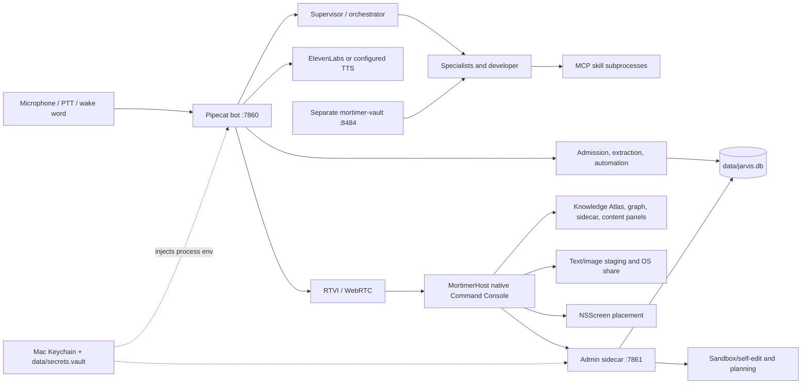

# Mortimer architecture reference

**Reference status:** maintained source map, added 2026-09-18. **Last source
audit:** 2026-09-18. This document is a navigation and verification aid; the
track plans remain authoritative for requirements and acceptance gates.

## Runtime shape



The bot owns the voice session, Supervisor turn, tool registration, memory
session lifecycle and speech output. `MortimerHost` owns native windows,
layout, drawer tabs, Atlas/graph state, display placement and user-facing
content sharing. The admin sidecar owns self-edit, planning, run status and
HTTP-backed inspection. MCP servers are subprocess capabilities with declared
credential requirements; they do not own UI state. SQLite is the durable owner
for conversations, memories, jobs, receipts and run metadata.

The browser client remains a compatibility surface. The native host's layout 2
is the current Command Console path. The web UI and legacy native layouts stay
available for rollback until the Command Console physical and daily-driver
gates close.

The architecture document is also an operating surface. The self-edit
authoring loop receives a bounded read-only copy of this file together with
`docs/REPO_MAP.md` before it proposes changes, so it can reason from the same
ownership and model-routing contract that reviewers use. The localhost admin
API exposes the source at `GET /api/architecture`; the native Repo sidecar
renders the full document and its SHA-256 digest for direct inspection. Both
paths read this file on demand and do not maintain a second copy or grant any
additional edit authority.

## Trust and data boundaries

- The bot and sidecar bind to localhost during the current release. Remote
  access is a separate roadmap track and is not implied by the native UI.
- User speech is transient audio, transcript input and (when enabled) a local
  conversation row. Memory admission is bounded, redacts credential patterns,
  and applies source-role and evidence policy before durable promotion.
- Automated memory classification receives bounded redacted candidates. It
  returns metadata; it cannot grant permissions, write arbitrary content, or
  replace a user correction. Shadow receipts contain a digest and metrics, not
  candidate text.
- Inbound text/image content is staged locally, then requires an explicit
  approval manifest before provider delivery. Imported content and derived
  results are ephemeral under the approved temporary-content policy.
- Outward sharing freezes the selected result before opening the OS picker.
  Opening a picker is not reported as delivery.
- Secrets are loaded by `jarvis.vault.inject_env()` from
  `data/secrets.vault` and the macOS Keychain. A running checkout may use
  `JARVIS_VAULT_PATH`; secrets are never copied into candidate worktrees or
  committed to `.env`.

## Model routes

There is no single project-wide model setting. `OPENAI_MODEL` and
`OPENAI_BASE_URL` configure the voice Supervisor path in `jarvis/config.py`;
they do not select every background or planner workload.

The Model Use Enhancements foundation adds `config/model_access.yaml` and
`jarvis/model_routing.py`. That policy separates canonical model identity from
the access route (`direct_api`, `subscription`, `codex_subscription`, `saygm`,
or `local`) and from
the workload privacy requirement. `JARVIS_MODEL_ROUTING_ENABLED` defaults to
false while the adapters are being qualified; enabling it applies the policy
to routed agent and background call sites. Explicit route/profile environment
overrides are `JARVIS_MODEL_ROUTE_<WORKLOAD>` and
`JARVIS_MODEL_PROFILE_<WORKLOAD>`.

`jarvis/saygm.py` parses the SAYGM model catalog. A SAYGM route is only marked
confidential after catalog metadata confirms both `tier: confidential` and the
documented `-TEE` model suffix. Frontier or open SAYGM routes remain external
processing even when their upstream model is Anthropic or OpenAI. The route
status is available without credential values at `GET /api/model-routes`.
For a repeatable launch/readiness check, run
`scripts/verify_model_access.py`; it reports command/key presence without
printing secrets and only contacts providers when `--saygm` or the explicit
`--probe-subscriptions` option is passed.
`scripts/audit_model_call_sites.py --require-covered` provides the static
ownership inventory for every production completion call site; it is
secret-free and fails when a new call site lacks a routing classification.

`jarvis/privacy_policy.py` enforces local-only, confidential, and approved-
external requirements before a model request. `jarvis/model_execution.py`
provides the provider-neutral request/result contract; tool permissions remain
owned by the existing agent and sandbox layers. `jarvis/model_preferences.py`
stores expiring drafts and confirmed workload choices. The native Repo sidecar
and the gated `model_route` voice tool use that same confirmation boundary.
Enabled-mode confidential and local-only sub-agent policies also drive durable
run-log redaction. Council proposer, judge, planning, and shadow calls accept
an optional stricter `data_policy` carried by the request context and reject a
route that cannot satisfy it. The preserved `claude-haiku-4-5` supervisor is a
voice-only built-in route and is deliberately absent from the general model
registry.
Claude and Codex subscription adapters are text-only until their official
runtimes pass capability and isolation tests; they reject tool-bearing calls.
Before either CLI launches, `jarvis/subscription.py` removes inherited API
credentials and endpoint overrides so a subscription-labelled request cannot
silently become paid API traffic. Protected delegation task and failure text
is also replaced with a marker in activity events before stdout or native UI
delivery; the specialist and policy-aware durable run log retain the full
context where permitted.
When the per-turn sensitive latch is armed, the shared MCP registry refuses
external web, app, screen-vision, and self-edit servers before invocation;
local notes, memory, repository, and system tools remain usable.

| Workload | Source of selection | Current policy | Credential/endpoint behavior |
| --- | --- | --- | --- |
| Voice Supervisor/orchestrator | `OPENAI_MODEL`, `OPENAI_BASE_URL`, `jarvis/bot/pipeline.py` | Haiku is the designated dispatcher; it delegates and does not build | Voice configuration and its provider key |
| Scheduler, Librarian, Analyst, Systems | `config/agents.yaml` → `claude-sonnet-5` | Refuse on missing profile/key; never fall back to Supervisor | `config/upgrade_models.yaml` profile route |
| Developer, App Builder | `config/agents.yaml` → `claude-opus` | Refuse on missing profile/key; build-grade model | Registry profile route |
| Optional Codex subscription workload | explicit `codex-subscription` profile + `codex_subscription` route | Text-only until sandbox-preserving tools are validated; no API-key fallback | Authenticated Codex CLI subscription |
| Planner/self-edit executor | `JARVIS_UPGRADE_PROFILE` / `JARVIS_APPBUILD_PROFILE`, registry default as specified by plan | Explicit profile and refusal/fallback rules are recorded in the sidecar | Registry profile route |
| Research comparison writer | `JARVIS_PLANNING_PROFILE` → registry default | Background research is not run on the voice Supervisor; the selected registry profile is recorded with the result | Registry profile route plus Tavily crawl |
| Council | `jarvis/council/config.py` plus registry pool | Judges/proposers follow council exclusion and tier rules | Per-profile registry route; shared policy when routing is enabled |
| Vision | `vision` workload in `config/model_access.yaml` when routing is enabled; otherwise `JARVIS_VISION_PROFILE` | Image capability is required; invalid/missing profile fails closed | Validated registry profile route |
| Background extraction and maintenance sweep | `jarvis/memory_extraction.py`, `jarvis/memory_sweep.py` | Dedicated `JARVIS_MEMORY_PROFILE` route; defaults to registry `claude-sonnet-5` and fails closed when its credential is absent | Profile route via `jarvis/memory_model.py` |
| Knowledge-base digest and procedure description | `jarvis/kb_digest.py`, `jarvis/procedures.py` | Dedicated `JARVIS_BACKGROUND_PROFILE` route; defaults to registry `claude-sonnet-5` and never inherits the Supervisor route | Profile route via `jarvis/memory_model.py` |
| New memory classifier shadow and staged rollout | `jarvis/memory_automation.py`, `scripts/run_memory_provider_shadow.py --profile NAME` | Explicit registry profile is mandatory; runtime admission is ordered by `JARVIS_MEMORY_AUTOMATION_STAGE` (`shadow` → `explicit_preferences` → `corroborated_inferences`); unknown values fail closed | Profile supplies model, provider, endpoint, key name and temperature |

The background rows are intentionally separate from the voice route. Haiku is
reserved for the voice Supervisor/orchestrator; no registry profile used by an
agent, planner, research writer, vision call, memory job, digest, or procedure
job may resolve to Haiku. Each background family remains independently
selectable and can use any registered provider/model whose credential is
available. Before B6 live evaluation, choose and record a registry profile
whose provider key is available in the runtime vault. The dry-run command
verifies the route without reading credentials or making a provider call:

```sh
UV_CACHE_DIR=/private/tmp/jarvis-uv-cache uv run \
  --with-requirements requirements-lock.txt \
  python scripts/run_memory_provider_shadow.py --profile kimi-k3 --dry-run
```

For a live run, use the same command without `--dry-run`, from the runtime
checkout or pass its existing vault explicitly. Never copy the vault into the
release-review checkout. A live run remains an acceptance gate and must write
the bounded provider-shadow receipt before rollout begins.

## Configuration and deployment paths

The candidate worktree used for source verification is normally
`/Users/larryfix/Documents/Codex/2026-09-09/can/work/release-review`. The
runtime checkout inspected on 2026-09-18 is
`/Users/larryfix/jarvis-voice-ai-clean`; its vault is
`data/secrets.vault`, and its `.env` configures the voice route as
`https://api.anthropic.com/v1` with `claude-haiku-4-5`. Those paths must remain
separate. `JARVIS_VAULT_PATH` is the supported bridge for a candidate command.

The sandbox path is `sandbox/runtime.py` and `sandbox/session.py`; candidate
work is isolated and verified before a draft PR. The release checklist must
record the candidate revision, deployment fingerprint, test receipt and
rollback target. A passing source test does not prove the Mac runtime is
running that candidate.

The current launchd bot is a separate process from this candidate checkout:
the observed job runs from `/Users/larryfix/jarvis-voice-ai-clean`, with its
own database and vault. Its September 17 log confirms the live Supervisor is
`claude-haiku-4-5`; it does not prove that the candidate's Command Console or
dedicated memory route is loaded. The read-only display probe from the current
Codex shell reports zero `NSScreen` objects, which is a headless observation,
not a physical-display result. These distinctions are why candidate deployment
and loaded-version evidence remain open acceptance gates.

## Where to verify each surface

| Surface | Implementation | Acceptance evidence |
| --- | --- | --- |
| Native Command Console / Atlas | `macos/MortimerHost/`, `macos/JarvisKit/` | `docs/acceptance/command-console/STATUS.md`, physical Mac gates |
| Voice and shared actions | `jarvis/bot/`, `ConsoleProtocol` | `docs/acceptance/command-console/VOICE.md` |
| Memory admission and automation | `jarvis/memory.py`, `jarvis/memory_automation.py`, `jarvis/memory_sweep.py` | `docs/acceptance/memory-automation/STATUS.md` |
| Provider shadow | `scripts/run_memory_provider_shadow.py`, registry | B6 receipt and rollout metrics |
| Self-edit sandbox | `sandbox/`, `jarvis/selfedit/`, admin sidecar | adaptive-interface release readiness |
| Secrets | `jarvis/vault.py` | vault unit/integration tests and Mac status check |
| Display topology | `ScreenPlacement`, `run_display_topology_probe.sh` | physical display receipt; Spaces are not `NSScreen`s |
| Plan artifact integrity | `tests/unit/test_plan_manifests.py` | required implementation, fixture, test and acceptance files exist; the rendering-suite filename alias is documented |

## Known open gates

The architecture is documented, but documentation does not close the remaining
acceptance work. The memory plan still needs a provider-backed shadow receipt,
benefit/cost comparison and gradual rollout evidence. The Command Console still
needs physical display recovery, system sharing, VoiceOver/accessibility,
deployment identity and daily-driver evidence. These remain tracked in the
release-readiness checklist and must not be converted to checked boxes from
unit tests alone.
