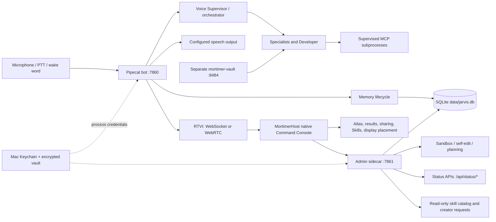

# Mortimer architecture reference

**Purpose:** source-navigation and ownership reference. Plans and acceptance
records remain authoritative for requirements and release gates. This file is
injected into planning/self-edit contexts and served read-only by the sidecar;
keep it below 12,000 characters.

## Runtime shape

```mermaid
flowchart LR
  MIC[Microphone / PTT / wake word] --> BOT[Pipecat bot :7860]
  BOT --> SUP[Voice Supervisor / orchestrator]
  SUP --> AGENTS[Specialists and Developer]
  AGENTS --> MCP[Supervised MCP subprocesses]
  BOT --> MEM[Memory lifecycle]
  MEM --> DB[(SQLite data/jarvis.db)]
  BOT --> TTS[Configured speech output]
  BOT --> UI[RTVI: WebSocket or WebRTC]
  UI --> HOST[MortimerHost native Command Console]
  HOST --> PANELS[Atlas, results, sharing, Skills, display placement]
  HOST --> SIDE[Admin sidecar :7861]
  SIDE --> EDIT[Sandbox / self-edit / planning]
  SIDE --> STATUS[Status APIs: /api/status/*]
  SIDE --> SKILLS[Read-only skill catalog and creator requests]
  SIDE --> DB
  VAULT[Mac Keychain + encrypted vault] -. process credentials .-> BOT
  VAULT -.-> SIDE
  KB[Separate mortimer-vault :8484] --> AGENTS
```

`jarvis/bot/bot.py` serves native WebSocket `/ws-client` and WebRTC
`/api/offer`. Local `JarvisClient` uses `NativeAudioTransport`; remote bot
connections use WebRTC. The bot owns voice sessions, Supervisor turns, tool
registration, memory-session lifecycle and speech. Late results wait in the
notice outbox for a later greeting. `MortimerHost` owns native windows, drawer
tabs, Atlas/graph state, display placement and content sharing. The admin
sidecar owns self-edit, planning, run status and HTTP inspection.

The voice Supervisor coordinates delegation and bounded direct voice/status
tools; it does not author code itself. Specialists and the Developer execute
their own work under their configured routes and tool grants. MCP servers run
as subprocesses managed by one supervised registry per bot process; each
server has an owning task, restart/status reporting and declared credentials.
The `jarvis/status` APIs are the source for system and MCP status; voice and
`mcp_status/` are clients of those APIs, not separate status authorities.
SQLite owns durable conversations, memories, requests, receipts and run
metadata. The knowledge-base service is a separate process and data store.

## Skills and Workflows

Skills and Workflows are different product concepts and must stay distinct in
the UI, APIs and data model. A **Skill** is a reusable, versioned instruction
package with declared metadata and process steps. A **Workflow** is an
operational sequence/status view describing system processes; it is not a
skill package and does not inherit skill activation or selection semantics.

The Skills Workspace candidate has read-only catalog/detail/version APIs and
native Skills, Activity and Versions views. Version evidence distinguishes a
manifest version, package digest, enabled registry pin and owner-scoped
candidate request; it does not imply activation or historical installed
revisions. Synthetic examples preview declared matcher behavior only. The
opt-in selector requires its rollout flags and verified route, tool,
capability, package-pin, readiness and privacy evidence. It selects one
primary skill and at most one mutually compatible support package within the
prompt budget; current packages do not declare compatible pairs, so selection
is single-skill. Voice can inspect declared steps/examples and hand a bounded
draft to creator review; it cannot publish or activate a skill.

Creator work must belong to a genuine Developer-agent run. The authenticated
admin request prepares a disposable sandbox, then dispatches through the
internal bot endpoint to the live Developer using
`jarvis/bot/skill_creator_dispatch.py`. The Developer RunLogger creates the
run ID; an atomic association binds that run to the owner-scoped creator
request, pinned creator revision and separate sandbox job before tools run.
The creator run receives only its four authoring tools. Validation activity
appends to the originating run without changing its terminal record; the
request, attempt and sandbox job remain distinct identities. A versioned
host-check receipt is bound to the exact run/request/skill revision/step/
attempt, expires, and is accepted once. Only implemented exact host checks
can produce trusted step evidence; a successful tool call or model-authored
event alone is not proof. Missing run identity must not be fabricated from a
request or sandbox ID. See [plan](plans/MORTIMER_SKILLS_WORKSPACE_IMPLEMENTATION_PLAN.md)
and [acceptance status](acceptance/skills-workspace/STATUS.md). This candidate
work is not evidence of deployment or live acceptance; its remaining gates
are recorded in those documents.

MCP registry credential policy treats external servers as data egress. When a
per-turn sensitive latch is armed, external web, app, screen-vision, self-edit
and status servers are refused while local tools remain available. Protected
run content is masked in activity/UI surfaces. When remote auth is explicitly enabled, status endpoints require bearer
authentication. With auth dormant, services bind only to loopback. Owner-scoped
APIs enforce authorization server-side,
not inferred from UI visibility or a caller-supplied tenant/run identifier.

## Trust and data boundaries

## Native interface and deployment boundary

`CommandConsoleView` (layout 2) is the default. Layouts 0/1 and
`scripts/run_web.sh` remain rollback paths until the Command Console physical
and daily-driver acceptance gates close. A sandbox test or passing source test
does not prove which build is running on the Mac. Deployment identity,
rollback target and physical monitor/accessibility evidence belong in the
release checklist.

Inbound text/images are staged locally and require an explicit approval
manifest before provider delivery. Sharing freezes the selected result before
opening the OS picker; opening the picker is not delivery. Credentials are
loaded by `jarvis.vault.inject_env()` from the encrypted vault and macOS
Keychain; `JARVIS_VAULT_PATH` selects the existing vault for a checkout. Never copy them into candidate worktrees or commit `.env` files.

## Model routes

There is no single project-wide model setting. `OPENAI_MODEL` and
`OPENAI_BASE_URL` configure only the voice Supervisor. Workload profiles and
access routes are separate: `config/model_profiles.yaml` names routine
profiles, `config/model_endpoints.yaml` is the deny-by-default endpoint/key
registry, and `config/model_access.yaml` defines access and privacy policy.
`jarvis/model_routing.py` resolves them; routing is gated by
`JARVIS_MODEL_ROUTING_ENABLED` and per-workload overrides. `claude-haiku-4-5`
is reserved for the voice Supervisor and is not a background profile.

| Workload | Selection / boundary |
| --- | --- |
| Voice Supervisor/orchestrator | Voice configuration; delegation and direct voice/status tools, never a builder. |
| Specialists and Developer | `config/agents.yaml` plus registry profile; fail closed when required profile/credential is unavailable. |
| Planner, self-edit, research, Council | Separate workload profiles; stricter privacy policy applies and route/fallback is recorded. |
| Memory extraction, sweep, KB digest, procedures | Independent background profile routes; never inherit the voice Supervisor route. Memory behavior and rollout gates are tracked in its acceptance plan. |
| Vision | Requires an image-capable approved profile; otherwise fails closed. |
| Research comparison writer | Separate `JARVIS_PLANNING_PROFILE` / registry selection; never inherits the voice model. |
| Knowledge-base digest and procedure description | `jarvis/memory_model.py` resolves `JARVIS_BACKGROUND_PROFILE`; background work stays independent of the voice route. |
| New memory classifier shadow | `scripts/run_memory_provider_shadow.py --profile NAME` is an opt-in evaluation; its results do not establish production admission or staged rollout acceptance. |
| Skills evaluation | Isolated opt-in workload; requires both budget and feature gates, has no route override or fallback, and is unavailable unless policy config enables it. |
| Claude/Codex subscriptions | Text-only adapters; tool calls are rejected, inherited API keys/endpoints are stripped, and there is no paid-API fallback. |
| SAYGM | Confidential only when catalog evidence confirms confidential tier and `-TEE`; other routes are external processing. |

`jarvis/privacy_policy.py` checks local-only/confidential/approved-external
before execution. Tool permissions remain with agent and sandbox layers.
`jarvis/model_execution.py` is the provider-neutral contract. Paid calls need
a known price and numeric spend ceiling before reservation. Subscription
probes and provider verification are opt-in; see
`scripts/verify_model_access.py`. `scripts/audit_model_call_sites.py
--require-covered` checks production completion call-site coverage. Live
provider probes must never be run as a documentation/build check.

## Verification map

| Surface | Source | Acceptance record |
| --- | --- | --- |
| Command Console / Atlas, voice | `macos/MortimerHost/`, `macos/JarvisKit/`, `jarvis/bot/` | `docs/acceptance/command-console/` |
| Skills Workspace | `jarvis/skill_catalog.py`, `/api/skills`, native `Console/SkillsWorkspaceView.swift` | `docs/acceptance/skills-workspace/STATUS.md` |
| Memory automation | `jarvis/memory.py`, `memory_automation.py`, `memory_sweep.py` | `docs/acceptance/memory-automation/STATUS.md` |
| Self-edit sandbox | `sandbox/`, `jarvis/selfedit/`, admin sidecar | adaptive-interface readiness records |
| Status/MCP | `jarvis/status/`, `/api/status/*`, `mcp_status/` | status/admin tests and live gates |
| Plan artifact integrity | `tests/unit/test_plan_manifests.py` | Required artifacts exist; presence does not prove live behavior. |
| Secrets | `jarvis/vault.py` | vault tests and Mac status check |
| Display topology | `ScreenPlacement`, `run_display_topology_probe.sh` | physical display receipt; Spaces are not `NSScreen`s |

Superseded plans and snapshots are historical material under `docs/archive/`.
Documentation does not close acceptance gates. Consult the linked status files
for current results and unresolved questions; do not infer deployment or
runtime behavior from source alone.
