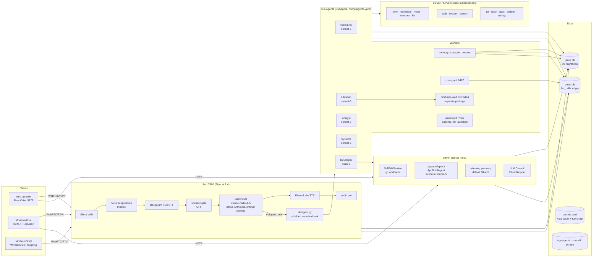

# Mortimer — architecture snapshot and gap analysis

**As of:** 2026-09-04, branch `feat/t4a-security-hardening` @ `baa9838` (pushed), `main` @ `47f674c`.
**Read from:** the working tree on your Mac (config, `jarvis/`, `mcp_servers/`, `macos/`, `web/src`, `scripts/`, `logs/`, `.git` refs), `CLAUDE.md` (last edited 2026-09-01), `docs/plans/*`, and the project memory from prior sessions. Nothing here is from the plans alone — every "exists" claim was checked against a file.

Confidence tags appear only where they change what you would do with the claim.

---

## 0. The short version — what you are missing

Ordered by how much it costs you if left alone, not by effort.

1. **Nothing built since Aug 27 has been through CI or merged.** 49 commits sit on `feat/t4a-security-hardening` (T4a hardening, optimization Phases 0–4, council roster, Session Misses). `main` is where it was in late August, and `validate.yml` only runs on PRs to `main`. The branch name no longer describes what is on it.
2. **The self-edit loop probably cannot pass its own validation right now.** [likely] Gate 4 runs `pytest tests/unit -q` in the worktree with a 300 s timeout (`VALIDATE_PYTEST_TIMEOUT_S`). The real-venv suite is ~2,156 tests with **6 standing failures**, and round `e48cfbe1` already died on "pytest: timed out after 300s". A nonzero exit fails the gate; two gate failures convene the E1 council. That is consistent with only 5 of 35 council rounds ever completing. Check: the last `selfedit validate` result in `logs/admin.log.1`, and whether the 6 failures reproduce inside a fresh worktree.
3. **The developer agent's map of its own codebase is stale.** `docs/REPO_MAP.md` (injected into the developer's system prompt) and `CLAUDE.md` mention none of: `usage_ledger.py`, `costs_api.py`, `memory_extraction*.py`, `kb_digest.py`, `effort.py`, `anthropic_shim.py`, `sensitive*.py`, `usage_watcher.py`, `mcp_kb`. The 25-iteration budget exists precisely because the developer was rediscovering the tree; the map now lies by omission about every Phase 0–4 module.
4. **The two UIs have already diverged.** The Costs tab (`CostsTab.swift`) and `CouncilRosterView` exist only in `MortimerHost`; the web drawer's `TabKey` union still has seven tabs and no costs surface at all. Yet `web/` is still launched by `mortimer.sh` and is still what the README tells you to open. The G1(e) "five consecutive daily-driver days" gate for deleting `web/` has never been recorded as started. You are maintaining 7.9K lines of TS and 11.4K lines of Swift for one product, and the decision to retire web was made on 2026-08-25.
5. **Single-key blast radius.** The voice loop, all five specialists, the developer, the planner default, vision, and the memory extractor ride `ANTHROPIC_API_KEY`. With `on_profile_fallback: refuse` on every specialist (correct per the floor policy), one rate limit or outage stops every delegation and the Supervisor with it. OpenRouter diversity exists only in the council pool. This is an accepted risk — but it is undocumented as one, and there is no "degraded mode" the system can announce.
6. **Live verification debt.** The stack was restarted 16:12 EDT on 09-03 (three minutes after the last commit — the "never restarted" note in memory was wrong), so Session Misses S1–S11 are loaded, but no voice session has connected since. Unrun: TTS character reconciliation against ElevenLabs (§8 steps 1/3/4), the late-result once-only check, the markdown-free TTS check, and speaker-gate `verify --windowed` on the 20 captures. The speaker gate has been **off since 2026-08-22** with no measured verdict.
7. **Council data quality.** `kimi-k3` abstained on every proposal across 3 rounds (empty error string) and is still `tier: mid` in the pool. Both Anthropic shadow judges failed 100% historically on `temperature`; the profiles now carry `temperature: null` so new rounds should be clean [likely], but every `agreement.py` verdict computed to date is from rounds with both Anthropic judges absent. `council_rounds.run_id` is NULL on all rounds and cannot be populated across the sidecar HTTP hop.
8. **No process supervision, no backups.** `mortimer.sh` is `nohup` plus a 6-second liveness check; a crash at 02:00 stays down. `data/jarvis.db` (the assistant's entire memory), `costs.db`, and `secrets.vault` are backed up by hand-copied `.bak` files. `launchd` is deferred to the Mac mini move; a nightly `sqlite3 .backup` is not.
9. **The cost lever you planned attacks the smaller line item.** [likely — one measured session] The 09-03 log review put TTS at $0.20–0.27 for a session whose LLM cost was $0.069. T3's cost premise is a local Supervisor LLM; the roadmap says TTS stays on ElevenLabs. If the next session's ledger confirms the ratio, local or cheaper TTS (Kokoro/Piper ship in Pipecat 1.4) is worth more than a local Supervisor, and the routing-eval ≥90% gate does not apply to it.
10. **Single-tenant by construction.** There is no user identity anywhere in `jarvis/db.py` (zero hits for `user_id`/`tenant`); `JARVIS_USER_NAME` is an env var. The roadmap says the backend is "user-keyed" for the subscription destination — it is not yet. Not urgent, but every new table added without a user column (19 migrations so far) is future migration work.
11. **Four of your stated near-term goals have no code:** remote access / iOS (T2, T1-iOS — no `jarvis/auth.py`, no bearer tokens, no iOS target), mail/calendar/daily brief (T5 — no `secretary` agent), local models (T3 — no Whisper/MLX in the pipeline), skill-authoring skill + Xcode rebuilds (T6). All have approved-in-principle plans from 08-26 whose status lines still read "DRAFT". Reminders only fire into a *connected* session (`reminders_watcher.py` checks the connection first) — with no push path, a reminder due while no client is attached is spoken never, not later.
12. **Documentation drift that will mislead the next planner (human or model):** root `ROADMAP.md` (08-18) still frames the Mac shell as "Electron-first wrapper, never a rewrite" — superseded on 08-25; `MORTIMER_PLATFORM_ROADMAP.md` says "DRAFT" though approved; `GATE_V2`, `SESSION_GAPS`, `CONFIRMATION_AND_CAPABILITY` status lines say draft/awaiting though implemented; `Procfile` is a reference inventory with a TODO that confuses the two "vaults". Speaking of which: `jarvis/vault.py` is the **secrets** vault and `~/mortimer-vault` (`:8484`, outside the repo, not version-controlled with Mortimer) is the **knowledge base**. Same word, two systems; the Procfile TODO already tripped on it.
13. **Repo hygiene:** `s1.wav s2.wav s3.wav tv.wav` (6.4 MB) at the root, `testrmdir/`, `zzz_test_old/`, `_to_delete_tarballs/`, `web/dist_verify*/`, a stale `.overmind.sock`, `.env.bak-haiku` (keys are commented out — verified — so it is clutter, not a leak).

The open **decisions** waiting on you, unchanged: research-note storage (options A–E; A recommended), plan-first enforcement in the developer prompt (Phase 3), and whether to freeze `web/` now.

---

## 1. System at a glance

**Mental model:** one voice-facing dispatcher (Haiku) that is forbidden from doing design or build work, five text-only specialists at Sonnet-or-better, one developer at Opus, and a sidecar-owned self-improvement loop (planner at Fable, executor at Sonnet, council as referee-never-author). State is local SQLite; cloud dependencies are Deepgram, ElevenLabs, Anthropic, Tavily, OpenRouter, Moonshot, GitHub.

---

## 2. Runtime processes (`scripts/mortimer.sh`, the one launcher)

| Process | Port | What it is | Notes |
|---|---|---|---|
| `mortimer-vault serve` | 8484 | Knowledge-base service from `~/mortimer-vault` (separate package, own venv) | Bot waits on it (`wait_for.sh`, 30 s). Not the secrets vault. |
| `jarvis.bot.bot` | 7860 | Pipecat pipeline, Supervisor, MCP registry, watchers | Vault-gated start |
| `jarvis.memory_extraction_worker` | — | Phase 2 extraction gate; polls `conversations` every 20 s | Needs DB + LLM only |
| `jarvis.admin.server` | 7861 | Admin sidecar: self-edit service, council, memory panel, runs, roster, ambient | Binds 127.0.0.1, **no auth** |
| Vite dev server | 5173 | Web console | Still the documented entry point |
| `jarvis.costs_api` | 8487 | Serves `cost_report.py` data over HTTP | For Costs tab (web + Swift) |
| `jarvis.wakeword.server` | 7862 | openWakeWord sidecar (`models/mortimer.onnx`) | **Not started by `mortimer.sh`**; `web/src/wakeWord.ts` and `JarvisKit/WakeWordListener` expect it |

`mortimer.sh` has `start|stop|logs`; `start` calls `stop_all` first, so a bare `./scripts/mortimer.sh` *is* the restart. Logs rotate 5 generations shell-side because most runtime output is `print()`.

---

## 3. Voice pipeline (`jarvis/bot/pipeline.py`)

`SmallWebRTCTransport` → Silero VAD → noise suppression (`JARVIS_NS_FILTER=rnnoise`; DeepFilterNet is the code default, eval harness in `scripts/eval_ns.py`) → `SpeakerTap` (only if gate enabled) → `DeepgramFluxSTTService` (`should_interrupt=False`, model-name keyterms) → `TranscriptGate` → context aggregator → **Supervisor LLM** → `ElevenLabsTTSService` (with the S9 markdown filter) → out.

Supervisor service selection is provider-aware: Google base URL → `GoogleLLMService`; Anthropic base URL + `llm_client.native_enabled()` → pipecat's native `AnthropicLLMService` with `enable_prompt_caching=True` (live today: `claude-haiku-4-5`, ledger shows 27/32 supervisor rows as cache reads); anything else → `OpenAILLMService`. `jarvis/anthropic_shim.py` is the *other* caching path — an OpenAI-shaped client over the native Messages API for `base.py`, `upgrade_agent.py`, `council.py`.

Supervisor direct tools (never delegated): `delegate_task(agent, task, model_profile?)`, `set_voice`, `remember`, `cost_summary`, `ui_control`, `view_screen`/`list_screens`, `show_commands`, clipboard read/clear (handoff loop). Bot-side watchers: reminders (30 s, connected-session only), `PlanWatcher`, `ProgressWatcher`, `ResearchWatcher`, `MemoryWatcher`, `UsageWatcher`, `InterruptionNotifier`, `SpeakingStateTracker`, `SensitiveTurn` (T4a financial suppression), late-result neutralizer (S6–S8).

Prompt: `GOLDEN_RULES` (4) front-concatenated onto `SUPERVISOR_PROMPT` (rules now run to **13**) plus `UI_CONTROL_ADDENDUM`; memory block (~9.8K chars / 71 facts after Phase 4 A1) rendered once per session inside the cached prefix (~8.7K tokens).

---

## 4. Agent roster

| Agent | Model (profile → identity) | Effort | MCP servers | Budget | On profile failure |
|---|---|---|---|---|---|
| **Supervisor** (voice) | `OPENAI_MODEL=claude-haiku-4-5`, Anthropic native | — | none (direct tools only) | per-turn | boots on one key |
| Scheduler | `claude-sonnet-5` → `anthropic/claude-sonnet-5` | low | time, reminders, screen | 5 iters / 45 s | refuse |
| Librarian | `claude-sonnet-5` | medium | notes, memory, **kb**, screen | 5 / 45 s | refuse |
| Analyst | `claude-sonnet-5` | medium | web (Tavily search, weather, radar, research_compare), screen | **15 / 120 s** | refuse |
| Systems | `claude-sonnet-5` | low | system, screen | 5 / 45 s | refuse |
| Developer | `claude-opus` → `anthropic/claude-opus-5` | — | git, apps, repo, selfedit, runlog, screen | **25 / 300 s**, `inject_repo_map` | refuse |
| Planner (planning pathway, plan review, site-research writer, Edit-panel picker) | registry `default` = `claude-fable-5` | — | — | `PLANNING_MEMBER_TIMEOUT_S=300` | — |
| Executor (`UpgradeAgent` self-edit / `AppBuildAgent`) | `JARVIS_UPGRADE_PROFILE` / `JARVIS_APPBUILD_PROFILE` = `claude-sonnet-5` | — | workspace seam (`SelfEditWorkspace` / `AppWorkspace`) | 50 iters / 30 min ; 40 / 60 min | — |
| Vision (`view_screen`) | first key-present `vision: true` profile → `claude-opus` | — | — | — | — |
| Background rungs (extraction, sweep merge/classify, kb digest, procedure description) | voice model (Haiku) — *not agents* | — | — | — | — |

Model floor (Larry, 2026-09-01, pinned by `tests/unit/test_model_floor.py`): only the Supervisor may run Haiku. Per-run overrides ("do this one with Opus") resolve through the same registry and always refuse rather than fall back; the reply gets `[ran on <model>]` appended mechanically.

**Delegation mechanics** (`delegate.py`): shielded detached task (barge-in survival), retry guard (same agent, 120 s, 0.5 token overlap → mechanical `REFUSED:`), `ITERATIONS_EXHAUSTED_MESSAGE` instead of the generic stuck message, `classify_tool_result` as the single success judge with an all-failed override, `learn_from_run` procedure capture, `late_delivery` injection when the result lands after the turn.

**Knowledge injection order in `SubAgent._loop`:** procedure hint → enabled skill (`config/skills.yaml`: 5 enabled) → workflow (`config/workflows/*.yaml`: 16 rules, no executor by design) → `AGENT_DISCIPLINE` (≤550 chars) → developer's section selector (`SECTION_MATCH_THRESHOLD=0.25`).

---

## 5. LLM Council (`jarvis/council/`)

Ranks, reviews, advises — never authors. Convenes on exactly three triggers: **E1** `_maybe_escalate` (self-edit validation failed twice and repair failed), **E2** `_maybe_scope_council` (off-allowlist decline), **E3** manual (`POST /api/council/convene`, `POST /api/selfedit/reject`), plus `draft_candidates` for competing plans (planner start tier 2, proposers `["frontier"]`, judges capped at 2 with `mid → frontier → economy` preference — Rev 3.3). "Convening is never predictive" is the founding rule; no council-per-task.

Pool (`config/upgrade_models.yaml`, 13 profiles, `identity` unique-enforced so a model never judges itself): direct — `kimi-k3` (mid, 240 s rope, **dead as a judge in 3 rounds**), `kimi-k2` (economy), `claude-opus`, `claude-fable-5` (frontier, vision), `claude-sonnet-5` (mid); OpenRouter — `or-gpt-5-mini`, `or-gemini-flash`, `or-deepseek` (economy), `or-gpt-5.1`, `or-grok-4.3` (mid), `or-codex-max`, `or-grok-4.6`, `or-deepseek-v4-pro` (frontier). Kill switch `JARVIS_COUNCIL_ENABLED`. Records: `council_rounds` (+`retry_outcome` from 0018, `run_id` always NULL), `council_scores` (`shadow` flag), `logs/council/<date>/<round>.jsonl`. Roster surfaced via `GET /api/council/roster` → `CouncilRosterView` (Swift only).

---

## 6. MCP skill servers (`mcp_servers/*`, `config/mcp_servers.yaml`)

Thirteen, each `logic.py` (pure) + `server.py` (FastMCP over stdio) + `skill.yaml` (whose `requires_env`/`optional_env` is the K2 **allowlist** of what reaches the child — `BASE_ENV_KEYS` + declared names only, frozen by `tests/unit/test_requires_env_snapshot.py`):

`mcp-time`, `mcp-reminders` (financial gate), `mcp-notes` (financial gate), `mcp-memory` (review-queue voice control + `memory_search` incl. archived), `mcp-kb` (`kb_search/kb_read/kb_neighbors` over `:8484`), `mcp-web` (Tavily search/crawl, weather.gov, RainViewer, `research_compare_*`), `mcp-system`, `mcp-screen` (all five agents; `requires_env_dynamic` for the vision key; cloud vision call every capture), `mcp-git` (draft→confirm commits, refspec push), `mcp-repo` (local tree, path-confined, draft→confirm writes), `mcp-apps` (GitHub-only app scaffolding + `app_build_*`), `mcp-selfedit` (thin client of the sidecar; `selfedit_*`, `plan_*`), `mcp-runlog` (read-only, developer only).

---

## 7. Data and state

**`data/jarvis.db`** (6.1 MB, 19 migrations): conversations (+FTS), `actions` (draft→confirm gate shared by git/repo/plan-adopt/research_save), memory facts with tiers (`identity/preference/project/system`), archive (`became`), reviews (0015), extraction v2 + pending (0016/0017), recall events (0019), observations, `agent_runs`/`agent_events` (+`model` column), `procedures` (+FTS, task tokens), `council_rounds`/`council_scores` (+`retry_outcome` 0018), reminders, notes, app registry.

**`data/costs.db`**: `llm_calls` ledger — `rung` (`supervisor|extraction|sweep_merge|council|developer|tts|stt|...`), cache read/write tokens, `plan_state` (`planned|planless`, executor rungs), `quantity/unit` for voice rungs (S1). Priced by `config/model_prices.yaml`; read by `scripts/cost_report.py`, `costs_api`, the `cost_summary` voice tool, and the Costs tabs. `scripts/pull_openrouter_activity.py` reconciles OpenRouter.

**`data/secrets.vault`**: AES-256-GCM, key in Keychain (or `JARVIS_VAULT_KEY`), 10 secrets injected at boot (`inject_env()` at four call sites), CLI-only management. `.env` now holds only non-secret settings.

**Files:** `logs/agents/<date>/<run>.jsonl` (30-day retention), `logs/council/` (180 d), `logs/screen/` (48 h), `logs/*.log` ×5 generations, `data/selfedit_worktrees/<slug>/`, `data/app_workspaces/`, `data/speaker_captures/` (20 WAVs from 08-22), `data/speaker_profile.*`, `models/mortimer.onnx`.

**Outside the repo:** `~/mortimer-vault` (the KB; link model unknown; needed for the research-storage decision).

---

## 8. Trust and safety mechanisms (the ones that are load-bearing)

Golden Rules + numbered Supervisor rules, each with a named mechanical backstop; single tool-success judge (`toolresult.py`) with post-failure constraint injection; retry guard; honest iteration exhaustion; barge-in survival via `asyncio.shield`; per-run model requests that refuse rather than substitute; three-tier self-edit allowlist (deny > allow > core; core needs `plan_path`, preflight refuses before staging, five validation gates, human merges on GitHub); self-edit sessions in isolated git worktrees (never the user's checkout); env scoping per MCP child (K2); agent isolation sets (K4, `test_agent_isolation.py`); financial-content suppression in transcript/run-log/memory (`sensitive.py`, `SensitiveTurn`, 162/162 patterns); key-health probe at boot (`rejected/unfunded/unreachable`); skills gated by `config/skills.yaml` (one-at-a-time import rule) and by construction (no exec); missing-tool honesty routed to `selfedit_start`; human-only files: model registry, skills.yaml, upgrade_agent.yaml, the allowlist, `db.py`, `macos/**`, CI.

Kill switches: `JARVIS_COUNCIL_ENABLED`, `JARVIS_UI_CONTROL_ENABLED`, `JARVIS_SPEAKER_GATE_ENABLED` (**false**), `JARVIS_SCREEN_ENABLED`, `JARVIS_RUNLOG_ENABLED`, `JARVIS_PROCEDURES_ENABLED`, `JARVIS_AGENT_SKILLS_ENABLED`, `JARVIS_WORKFLOWS_ENABLED`, `JARVIS_PROGRESS_UPDATES_ENABLED`, `JARVIS_RESEARCH_ENABLED`, `JARVIS_DEVELOPER_SECTIONS_ENABLED`, `JARVIS_KEY_HEALTH_ENABLED`, `JARVIS_CLIPBOARD_ENABLED`, `JARVIS_VAULT_ENABLED`, `JARVIS_NS_ENABLED`, `JARVIS_ENV_SCOPING_ENABLED`.

---

## 9. Interfaces

**Web console** (`web/`, 43 files / 7.9K lines, three Vite entries: main, display window, drawer window): RTVI client via `@pipecat-ai/client-js`; side drawer with seven tabs (Repo, Edit, Memory, Runs, Agents, Output, Log — no Costs); pop-out to a second display via `BroadcastChannel` relays (`drawerRelay.ts`, `popoutWindow.ts`) — machinery that exists only because browser windows are separate JS contexts.

**MortimerHost** (`macos/MortimerHost`, SwiftUI over **JarvisKit**): the T1.3 native app — console (orb field, voice wave, mic controls, top bar, ambient strip, vitals), display window, drawer with the seven web tabs plus **Costs** and `CouncilRosterView` (both Swift-only); `AgentRunStore` is the `agentRuns.ts` reducer ported verbatim; glass via `AppTheme/Glass.swift` with a `JARVIS_GLASS_ENABLED` rollback default. Builds and passes 87 JarvisKit tests + 3 Host test files as of 09-03. **JarvisKit** took transport branch B (direct WebRTC over `stasel/WebRTC`; the Pipecat iOS SDK probe was never run — no Swift toolchain in any assistant environment). `KeychainStore` is auth-token-only, ready for T2 tokens that do not exist yet.

**MortimerShell**: the outgoing WKWebView shell; scheduled for deletion by T1.4 after G1(e). **GlassSpike**: throwaway T1.1 target awaiting your sign-off to delete.

---

## 10. Roadmap tracks vs code (from `docs/plans/MORTIMER_PLATFORM_ROADMAP.md`, approved 08-26)

| Track | Plan | Code on disk | Gate |
|---|---|---|---|
| T1.1 glass spike | NATIVE_CLIENT_CORE | `GlassSpike/` exists | G1(a) — unsigned |
| T1.2 JarvisKit | NATIVE_CLIENT_CORE | built, tested | — |
| T1.3 MortimerHost | NATIVE_CLIENT_APP ("DRAFT") | built, runs | G1(e) five daily-driver days — not started |
| T1.4 delete `web/` | WEB_RETIREMENT ("DRAFT") | nothing | gated on G1(e) |
| T1 iOS | — (unwritten) | nothing | — |
| T2 remote access / auth | REMOTE_ACCESS ("DRAFT") | **nothing** (`jarvis/auth.py` absent, no bearer anywhere) | G2 |
| T3 mini + local models (+T3.6 local vision) | LOCAL_VOICE_AND_MINI ("DRAFT") | nothing | needs hardware |
| T4a hardening | SECURITY_HARDENING | **done** (K2 scoping, K3 sensitive, K4 isolation, snapshot test) — on the branch | ungated |
| T4b sensitive/financial tier | unwritten (your rule: after the mini) | nothing | G3 |
| T5 mail / calendar / brief | MAIL_CALENDAR_BRIEF ("DRAFT") | nothing (no `secretary`, no IMAP/EventKit) | — |
| T6 skill-authoring + Xcode rebuild | SKILL_AUTHORING ("DRAFT") / unwritten | nothing (only `mcp-server-authoring` skill) | — |
| Optimization Phases 0–4 | OPTIMIZATION_PLAN Rev 3.4 | Phases 0, 0b, 1, 1b, 2, 3 (split + instrumentation), 4 Stage A done; Phase 3 eval sets, Phase 4 Stage B, Phase 5 not | data gates (one clean week from 09-03) |
| Session Misses S1–S11 | SESSION_MISSES (approved) | done, loaded since 09-03 16:12 | §8 verification unrun |

---

## 11. Suggested order of operations

If you do nothing else this week, do the first three; they are cheap and everything after depends on them.

1. **Open the PR to `main` now** (or cut a fresh branch from it so the name matches the work). Let CI run on the 49 commits once before adding more. If CI's `Unit tests` step shows the 6 standing failures, that answers item 2 too.
2. **Fix or quarantine the 6 standing failures**, then confirm a self-edit's gate 4 passes inside a worktree in under 300 s (or raise `VALIDATE_PYTEST_TIMEOUT_S` / run only fast markers in the gate — a separate decision). Until then treat every E1 council round as noise.
3. **Regenerate `docs/REPO_MAP.md`** to cover the Phase 0–4 modules and `mcp_kb`; update `CLAUDE.md` in the same commit. Then re-run `RUN_LIVE=1 python -m tests.evals.routing_eval` (68 cases) — rule 13 landed without one.
4. **Run one real voice session** and close Session Misses §8 (five commands, listed in the memory file) and `python -m jarvis.speaker verify --windowed data/speaker_captures/*.wav`. That yields the TTS ratio and the speaker-gate verdict — two numbers that decide items 9 and 6 above.
5. **Decide the UI freeze.** Either declare MortimerHost the daily driver today (start the G1(e) clock, stop adding web features) or explicitly keep parity — Costs and the roster already broke it.
6. **Add a nightly backup** (`sqlite3 data/jarvis.db ".backup ..."`, same for `costs.db`, `python -m jarvis.vault export-key` once) and a `launchd` KeepAlive for `mortimer.sh` — you were going to do launchd after the mini; the KeepAlive part costs one plist and works on the Air now.
7. Then the roadmap in its approved order: T2 (auth first — it unblocks iOS, the brief, and any Tailscale access) → T5 → T3.

---

## 12. Structured disagreements with the plans as they stand

- **Local Supervisor as the cost lever (T3).** Reason: one measured session shows TTS at 3–4× LLM. Alternative: measure two more sessions with the S1 ledger, then rank levers by dollars. Downside of the current plan: the mini purchase is justified by a lever that may be the smaller one. [likely]
- **Mini before the financial tier, mini before launchd.** The first is your binding rule and I am not contesting it. The second conflates two things: process supervision is hardware-independent. Downside of waiting: every unattended crash between now and the mini is downtime you cannot see.
- **Keeping `kimi-k3` in the judge pool.** Reason: three rounds of 100% abstention with an empty error string is a dead member, and `_partition_judges` still counts it. Alternative: drop it to `tier: economy` or remove it until the empty-error cause is found. Downside of leaving it: mid-tier judge depth reads as 3 when it is 2.
